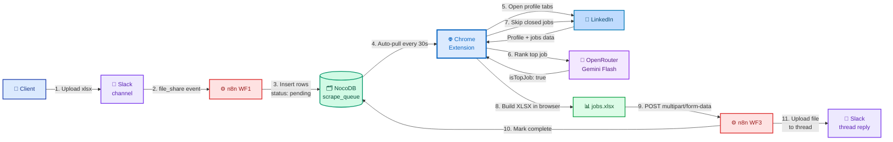
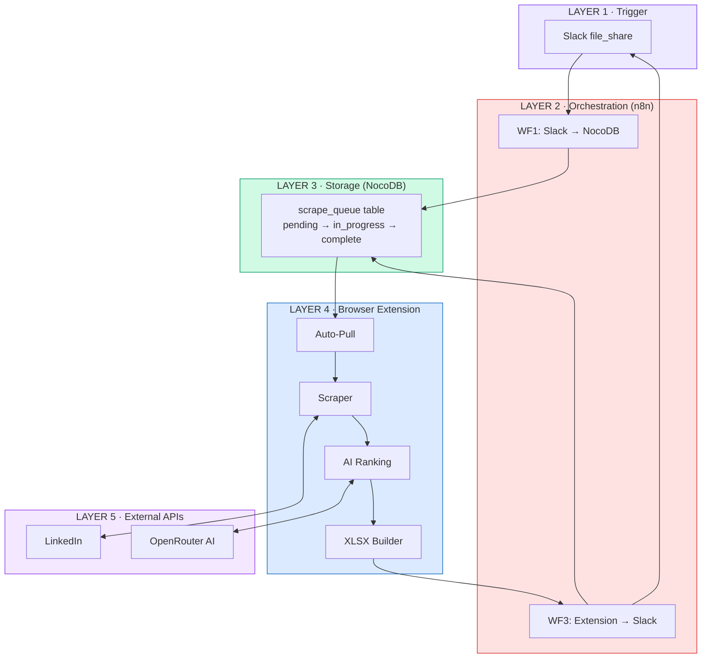
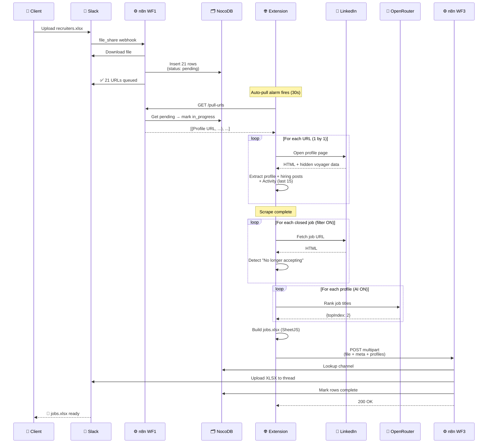
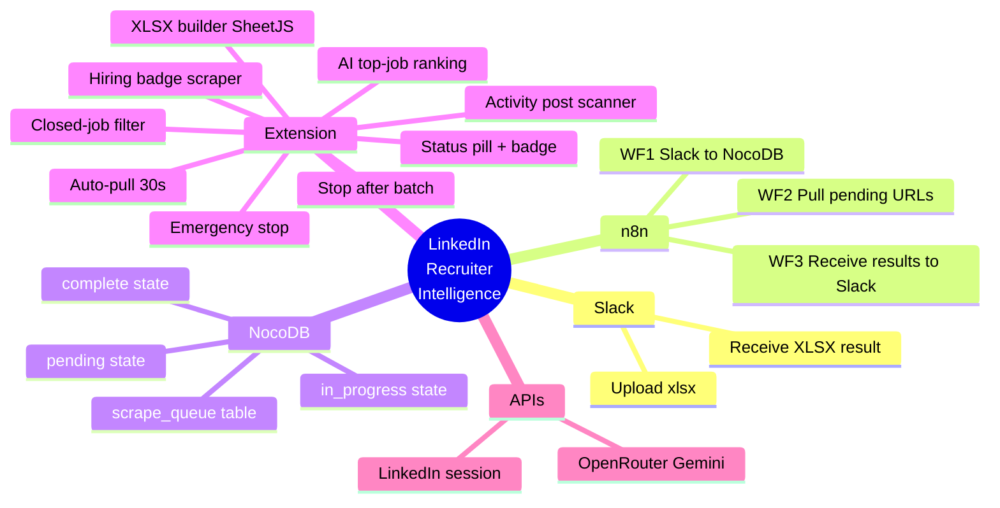

# LinkedIn Recruiter Intelligence — Architecture

> Clean block flow diagrams using **Mermaid** (built into Obsidian, no plugin needed).
> Just open this file in Obsidian — diagrams render automatically.

---

## 🎯 High-Level Flow (Show this to the client)



---

## 🔄 Detailed Flow with Subsystems

```mermaid
flowchart TB
    subgraph INPUT [" 📥 INPUT "]
        direction LR
        Client[👤 Client] --> SlackIn[💬 Slack<br/>Upload xlsx]
    end

    subgraph ORCH1 [" ⚙️ Workflow 1 — Slack to NocoDB "]
        direction TB
        WF1Web[Webhook<br/>/upload-csv] --> Parse1[Parse Slack<br/>event]
        Parse1 --> Download[Download xlsx<br/>from Slack]
        Download --> Extract[Extract<br/>rows]
        Extract --> Insert[Insert to<br/>NocoDB]
        Insert --> Notify1[Reply on<br/>Slack thread]
    end

    subgraph STORE [" 🗂️ Storage Layer "]
        direction LR
        Pending[(pending)] -.-> InProgress[(in_progress)]
        InProgress -.-> Complete[(complete)]
    end

    subgraph EXT [" 🌐 Extension Loop "]
        direction TB
        AutoPull[Auto-pull<br/>every 30s] --> WF2Web[GET /pull-urls]
        WF2Web --> ScrapeBatch[Scrape profiles<br/>1 by 1]
        ScrapeBatch --> Activity[Method 4:<br/>Activity posts<br/>last 15]
        Activity --> ClosedFilter[🚫 Filter<br/>closed jobs]
        ClosedFilter --> AIRank[🤖 AI rank<br/>top job]
        AIRank --> BuildXlsx[📊 Build XLSX<br/>SheetJS]
    end

    subgraph ORCH3 [" ⚙️ Workflow 3 — Extension to Slack "]
        direction TB
        WF3Web[POST /scrape-results] --> ParseMulti[Parse multipart<br/>file + meta]
        ParseMulti --> Lookup[Lookup channel<br/>from NocoDB]
        Lookup --> SlackUp[Upload XLSX<br/>to thread]
        SlackUp --> MarkDone[Mark rows<br/>complete]
    end

    subgraph OUTPUT [" 📤 OUTPUT "]
        SlackOut[💬 Slack thread<br/>📎 jobs.xlsx<br/>🎉 done]
    end

    INPUT --> ORCH1
    ORCH1 --> Pending
    Pending --> EXT
    EXT --> InProgress
    EXT --> ORCH3
    ORCH3 --> Complete
    ORCH3 --> OUTPUT

    classDef section fill:#f9fafb,stroke:#374151,stroke-width:1px
    class INPUT,ORCH1,ORCH3,STORE,EXT,OUTPUT section
```



---

## 🏗️ Layer-by-Layer View



---

## 🔢 Sequence Diagram (Step-by-Step)



---

## 📋 Component Cheat-Sheet



---

## 📌 How to Use in Obsidian

```
1. Copy this file to your Obsidian vault
2. Open it — Mermaid renders automatically
3. NO plugin needed (Mermaid is built-in since v0.13)
4. Edit by changing the text inside ` ```mermaid ... ``` `
5. Export: right-click any diagram → "Open as PNG/SVG"
```

## 🎨 Customizing Colors

Replace the `classDef` lines at the bottom of any diagram. Format:
```
classDef name fill:#hexcolor,stroke:#hexcolor,stroke-width:2px
```

## 🛠️ Optional Plugins (if you want fancier)

| Plugin | Purpose |
|--------|---------|
| **Excalidraw** | Hand-drawn / sticky-note style diagrams |
| **Diagrams** (drawio) | Full BPMN / UML / network diagrams |
| **D2** | Modern diagramming language |

For client presentations, **Mermaid is enough** — it's clean, professional, and version-controllable.
